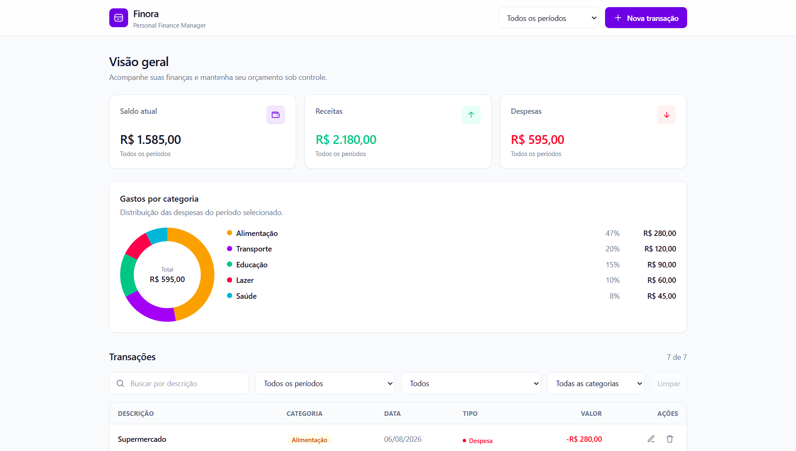

# 💰 Finora

A privacy-focused personal finance manager built with **React, TypeScript and Tailwind CSS**.

Finora allows users to track income and expenses, visualize spending by category, filter transactions and keep their financial records stored locally in the browser — without accounts, analytics, external APIs or remote databases.

> 🔐 **Your financial data stays on your device.**

---

## 👀 Preview

<!--
Add the project screenshot here after deployment.

![Finora Dashboard]
-->

🚀 **Live Demo:** [Open Finora](https://mateusbueno2034.github.io/Finora/)

---

## 📌 About

**Finora** is a personal finance dashboard designed to provide a simple and organized way to manage everyday finances.

The project was built both as a practical application and as a portfolio project focused on demonstrating front-end development skills with **React and TypeScript**.

Unlike many financial applications, Finora follows a **local-first architecture**.

There is no backend, user account or remote database. Transactions are stored directly in the browser using `localStorage`.

This allows the application to work without sending financial records to an external server.

---

## ✨ Features

### 📊 Dashboard

- Current balance
- Total income
- Total expenses
- Monthly financial overview
- Automatic recalculation when transactions change

### 💳 Transaction Management

- Add transactions
- Edit transactions
- Delete transactions
- Income and expense types
- Multiple financial categories
- Date selection
- Runtime input validation

### 🔎 Filtering

Transactions can be filtered by:

- Description
- Month
- Category
- Transaction type

Filters update the displayed data dynamically.

### 🍩 Expense Visualization

Finora includes a custom **SVG donut chart** that displays expenses grouped by category.

The chart is implemented using native SVG and React, without external chart libraries.

### 💾 Local Persistence

Transactions are stored in the browser using:

```text
localStorage
```

Persistence is handled through a dedicated storage service instead of being accessed directly throughout the components.

Persisted data is validated before being accepted by the application.

Invalid or corrupted JSON does not cause the application to crash.

### 📦 Backup & Restore

Finora allows users to:

- Export financial records as a JSON backup
- Import a previous backup
- Restore transactions locally
- Validate backups before replacing current data

Backup files use a versioned structure to support future changes to the data format.

> ⚠️ Exported backups are readable JSON files and should be stored in a safe location.

---

## 🔐 Privacy & Security

Privacy is treated as an architectural requirement of Finora rather than an optional feature.

Financial records remain inside the user's browser.

### 🛡️ Privacy Principles

Finora has:

- No backend
- No remote database
- No user accounts
- No analytics
- No telemetry
- No advertising trackers
- No external APIs
- No third-party scripts
- No external fonts
- No remote logging

The application does not require financial records to be transmitted to a server.

### 🚫 Network Access

The production version uses a restrictive **Content Security Policy (CSP)**.

Among its restrictions:

```text
connect-src 'none'
```

This prevents the application from establishing network connections using mechanisms such as:

```text
fetch
XMLHttpRequest
WebSocket
EventSource
sendBeacon
```

Since Finora is entirely local-first, no network connection is required for transaction management.

### 🧱 XSS Protection

User-provided content is rendered through React's standard text interpolation.

The project does not use unsafe HTML execution mechanisms such as:

```text
dangerouslySetInnerHTML
innerHTML
outerHTML
document.write
eval
new Function
```

Content entered into transaction fields is treated as text rather than executable HTML.

### ✅ Runtime Validation

Information coming from `localStorage` or imported backup files is treated as untrusted input.

A transaction must pass runtime validation before being accepted.

Validation includes:

- Valid transaction ID
- Valid description
- Finite numeric amount
- Amount greater than zero
- Valid transaction type
- Allowed category
- Valid date

Invalid persisted data or malformed backup files are rejected safely.

### ⚠️ Security Scope

Finora is designed for financial organization and expense tracking.

It should **not** be used to store highly sensitive credentials such as:

- Passwords
- Credit card numbers
- CVV codes
- Banking credentials
- Authentication tokens
- API keys

---

## 🛠️ Tech Stack

### ⚛️ Front-end

- React
- TypeScript
- Tailwind CSS

### ⚙️ Tooling

- Vite
- pnpm

### 🌐 Native Browser APIs

- `localStorage`
- Blob API
- File API
- `crypto.randomUUID()`
- `Intl.NumberFormat`

No external UI, chart, form, state-management or persistence libraries are required.

---

## 🏗️ Architecture

Finora separates presentation, application logic, persistence and utility functions.

```text
src/
├── components/
│   ├── backup/
│   ├── dashboard/
│   ├── filters/
│   ├── layout/
│   ├── transactions/
│   └── ui/
│
├── data/
├── hooks/
├── services/
├── types/
├── utils/
│
├── App.tsx
├── main.tsx
└── index.css
```

### 📂 Responsibilities

**`components/`**  
Reusable interface components.

**`hooks/`**  
Application state and transaction-management logic.

**`services/`**  
Local persistence and backup operations.

**`types/`**  
TypeScript domain models.

**`utils/`**  
Validation, formatting and financial calculations.

**`data/`**  
Categories and initial demonstration data.

---

## 🔄 Data Flow

```text
User Interface
      │
      ▼
React Components
      │
      ▼
useTransactions
      │
      ▼
Validation & Business Logic
      │
      ▼
Storage Service
      │
      ▼
localStorage
```

There is no remote server involved in the transaction flow.

---

## 🧾 Transaction Model

Transactions use strongly typed TypeScript models.

```ts
type TransactionType = 'income' | 'expense';

interface Transaction {
  id: string;
  description: string;
  amount: number;
  type: TransactionType;
  category: TransactionCategory;
  date: string;
}
```

Values loaded from storage or backup files are validated at runtime before being treated as valid `Transaction` objects.

---

## 🧮 Financial Calculations

Dashboard information is derived directly from transaction data.

The project makes extensive use of JavaScript array operations such as:

```text
filter()
map()
reduce()
```

Finora calculates:

- Total income
- Total expenses
- Current balance
- Expenses by category
- Category percentages
- Filtered monthly results

Currency values are formatted using:

```ts
Intl.NumberFormat('pt-BR', {
  style: 'currency',
  currency: 'BRL'
})
```

---

## ▶️ Running Locally

### 📋 Requirements

Make sure you have:

- Node.js
- pnpm

Clone the repository:

```bash
git clone YOUR_REPOSITORY_URL
```

Enter the project directory:

```bash
cd finora
```

Install dependencies:

```bash
pnpm install
```

Start the development server:

```bash
pnpm dev
```

Open the local address displayed by Vite.

---

## 📦 Production Build

Create an optimized production build:

```bash
pnpm build
```

Preview the production version locally:

```bash
pnpm preview
```

---

## 💻 Local-First Design

Finora intentionally does not use a backend in its current version.

```text
┌──────────────────┐
│      Finora      │
│ React/TypeScript │
└────────┬─────────┘
         │
         ▼
┌──────────────────┐
│     Browser      │
└────────┬─────────┘
         │
         ▼
┌──────────────────┐
│   localStorage   │
└──────────────────┘
```

This architecture keeps the application simple while allowing it to remain useful for real personal finance management.

Because data is browser-local, transactions are not automatically synchronized between different browsers or devices.

The backup system can be used to manually preserve or transfer financial records.

---

## 📚 What I Practiced

Finora was created to practice and demonstrate:

- ⚛️ React component architecture
- 🔷 TypeScript
- 🧩 Componentization
- 🪝 React hooks
- 📦 State management
- 📝 Controlled forms
- 🔄 CRUD operations
- ✅ Runtime validation
- 🗂️ Array manipulation
- 🔎 Dynamic filtering
- 🧮 Financial calculations
- 🍩 Native SVG visualization
- 💾 `localStorage` persistence
- 📁 File import/export
- 📱 Responsive design
- ♿ Accessibility
- 🔐 Content Security Policy
- 🛡️ Web security fundamentals
- 💻 Local-first architecture
- 🏗️ Separation of responsibilities

---

## 🗺️ Roadmap

Possible future improvements:

- [ ] 📊 Monthly budgets
- [ ] 🎯 Financial goals
- [ ] 📈 Month-to-month comparisons
- [ ] 📉 Additional financial charts
- [ ] 🌙 Dark mode
- [ ] 📄 CSV export
- [ ] 🔐 Optional encrypted local storage
- [ ] 🔑 Password-protected encrypted backups
- [ ] 📑 Improved financial reports

The **local-first architecture** will remain a core principle of the project.

---

## 🚀 Project Status

### Version 1.0 — Stable

Core functionality:

- ✅ Financial dashboard
- ✅ Transaction CRUD
- ✅ Dynamic filters
- ✅ Expense visualization
- ✅ Local persistence
- ✅ Backup export
- ✅ Backup import
- ✅ Runtime validation
- ✅ Responsive interface
- ✅ Content Security Policy
- ✅ No external API communication

---

## 👨‍💻 Author

Developed by **Mateus Henrique**.

Software Engineering student focused on software development, front-end technologies and building practical applications.

---

## ⚠️ Disclaimer

Finora is a personal finance organization tool.

It is not banking, accounting, investment or financial-advisory software.

Financial data is stored locally in the user's browser, and users are responsible for maintaining their own backups.